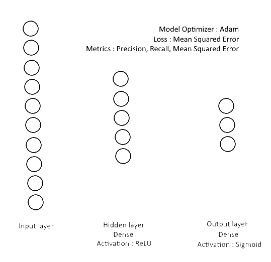

# VS Code Workspace

Hey ! Welcome to my personal workspace !

I am currently working on a crypto-trading AI project ~~to make some profit~~ for science !

Feel free to wander here and make any suggestion to help me improve the code

## AI Model

As I am currently not too sure about the model that I am using, let's describe it here so everyone can get quickly what it looks like

## Project Architecture

### btcDatas

Contains all of the datas being collected by the `PriceWatcher.py` background-running script. 

Also, this is actually not just raw data, it also contains some EMA (Exponential Moving Average) calculations, making it harder to maintain, or add other technical indicators in the future (I should probably start working on that "data" format some day 🤔)

### btcTrainingDatasets

These are the files generated by my `Datas2Datasets.py` script. I should probably use outside parameter to change the date of the file that I want to convert, but this will come later.

The big deal here is to find the right format to feed the AI training

### src/cryptos

Here comes the magic ! ✨

This folder contains the different scripts that I'm running to make it all work. This is a bit of my personal workshop, so please excuse the mess

| Script name        | Role |
| :----------------- | :--: |
| `CryptoTracker.py` | This is the test guy that I started before cutting all of the activities into micro-scripts. Maybe he'll come back later |
| `CryptoTrainer.py` | This is where I train my dude. We load the model, get some datas, complete the training, and save the model with the new weights. As we open and save the model everytime, this allows to perform successive trainings with differents Data files. WIP because I'm not satisfied with the training results |
| `Datas2Dataset.py` | This one here is more of an automated job. I call him whenever I want to convert datas for the training |
| `ModelMaker.py`    | There comes the AI's mind. This is where we generate our AI Model and save it for the first time, before training it |
| `PriceWatcher.py`  | The workaholic. This one's working day and night to retrieve the finest datas from the CryptoCompare API and save it into text files. We may later add an ETH watcher, if the AI shows encourageing results |